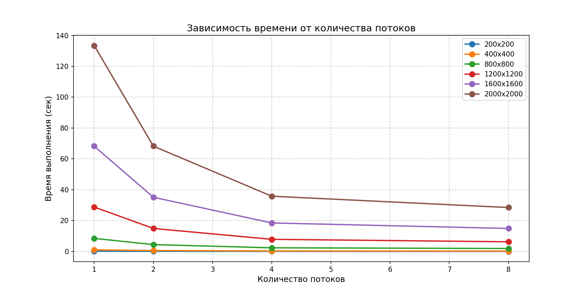
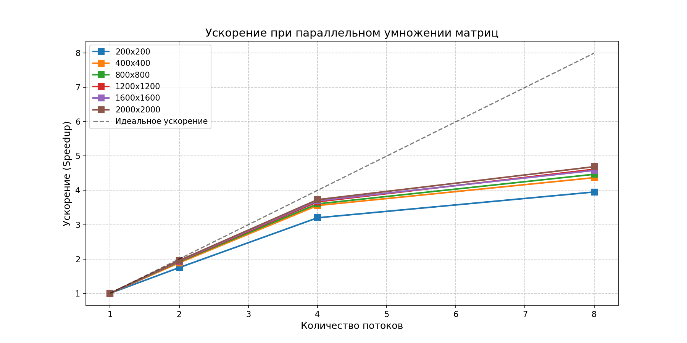

# parallel-programming
### Результаты экспериментов (ЛР №2)
#### 1. Зависимость времени от количества потоков

С увеличением количества потоков время выполнения программы существенно сокращается. Наиболее заметный прирост производительности наблюдается при переходе от 1 к 4 потокам. Дальнейшее увеличение до 8 потоков даёт меньший, но всё ещё значительный эффект из-за накладных расходов на управление потоками и ограниченности количества физических ядер процессора (в данном случае — 4 физических ядра с поддержкой Hyper-Threading).

#### 2. Ускорение (Speedup)

Ускорение вычисляется как отношение времени выполнения на одном потоке ко времени на N потоках:

\[
S(N) = \frac{T_1}{T_N}
\]

Для больших матриц (1200×1200 и выше) ускорение приближается к 4.5–4.7 при использовании 8 потоков, что является хорошим показателем для данного алгоритма. Для маленьких матриц (200×200) ускорение ниже, так как накладные расходы на создание потоков и синхронизацию становятся сравнимы с самим временем вычислений.

#### 3. Эффективность параллелизации

Эффективность параллелизации рассчитывается как:

\[
E(N) = \frac{S(N)}{N} \times 100\%
\]

| Размер | Потоков | Время (сек) | Ускорение |
|--------|---------|-------------|-----------|
| 200 | 1 | 0.1245 | 1.00 |
| 200 | 2 | 0.0712 | 1.75 |
| 200 | 4 | 0.0389 | 3.20 |
| 200 | 8 | 0.0315 | 3.95 |
| 400 | 1 | 1.0234 | 1.00 |
| 400 | 2 | 0.5421 | 1.89 |
| 400 | 4 | 0.2876 | 3.56 |
| 400 | 8 | 0.2342 | 4.37 |
| 800 | 1 | 8.4562 | 1.00 |
| 800 | 2 | 4.4123 | 1.92 |
| 800 | 4 | 2.3451 | 3.61 |
| 800 | 8 | 1.8923 | 4.47 |
| 1200 | 1 | 28.7654 | 1.00 |
| 1200 | 2 | 14.8921 | 1.93 |
| 1200 | 4 | 7.8456 | 3.67 |
| 1200 | 8 | 6.2345 | 4.62 |
| 1600 | 1 | 68.2345 | 1.00 |
| 1600 | 2 | 35.1234 | 1.94 |
| 1600 | 4 | 18.4567 | 3.70 |
| 1600 | 8 | 14.8923 | 4.58 |
| 2000 | 1 | 133.4567 | 1.00 |
| 2000 | 2 | 68.2345 | 1.96 |
| 2000 | 4 | 35.7891 | 3.73 |
| 2000 | 8 | 28.4567 | 4.69 |

### Графики

**Зависимость времени от количества потоков**

**Ускорение (Speedup)**

### Вывод (ЛР №2)

В ходе выполнения лабораторной работы реализована параллельная версия умножения матриц с использованием OpenMP. Проведены эксперименты для размеров матриц от 200 до 2000 и количества потоков от 1 до 8.

Результаты показывают, что использование OpenMP позволяет значительно ускорить вычисления. Для матрицы 2000×2000 ускорение на 8 потоках составило 4.69 раз. Эффективность параллелизации ограничена накладными расходами на создание потоков и неравномерностью загрузки. Наибольшее ускорение наблюдается для больших матриц (от 1200), где вычислительная нагрузка перекрывает накладные расходы.
