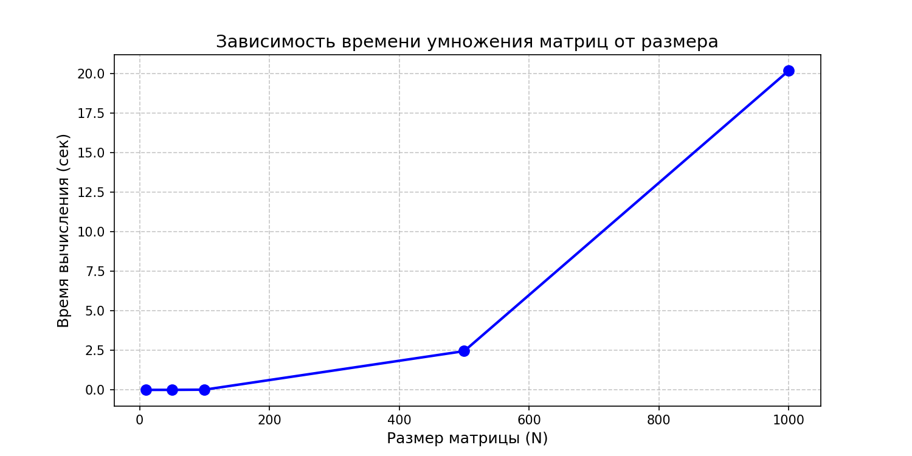
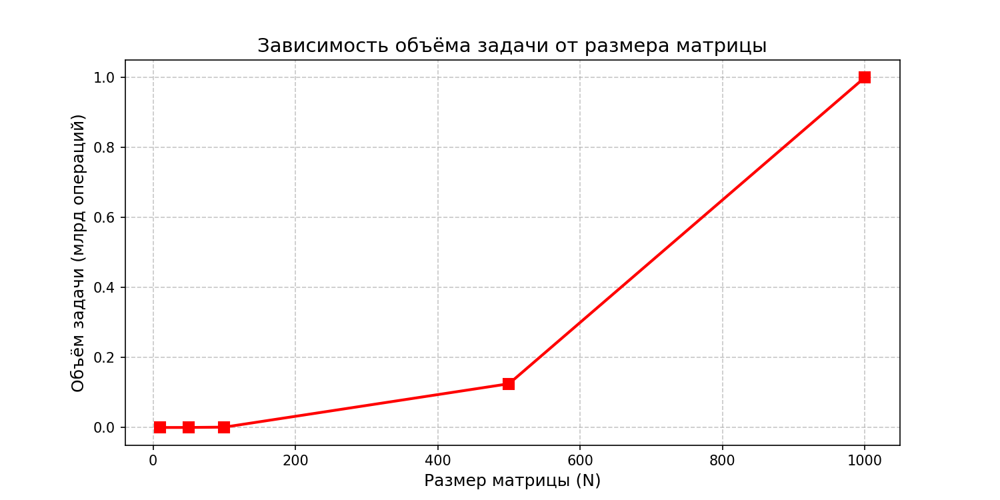

## Лабораторная работа №1
### Перемножение квадратных матриц

---

### Задание

Разработать программу на языке C++ для умножения двух квадратных матриц.  
Реализовать чтение матриц из файлов, запись результата, автоматическую верификацию через NumPy и сбор статистики производительности.

---

### Структура проекта

 parallel-programming/
├── src/             
│   ├── main.cpp      # Исходный код программы на C++
│   └── matrix        # Скомпилированный исполняемый файл
├── data/            
│   ├── matrixA.txt   # Входная матрица A
│   ├── matrixB.txt   # Входная матрица B
│   └── matrixC.txt   # Результирующая матрица C = A × B
├── generate.py       # Скрипт генерации тестовых матриц
├── verify.py         # Скрипт автоматизированной верификации
├── benchmarks.py     # Скрипт серии экспериментов
├── stats.csv         # Результаты экспериментов
└── README.md         # Думаю понятно :)

### Описание файлов

| Файл | Назначение |
|------|------------|
| `main.cpp` | Реализация алгоритма умножения матриц на C++ |
| `check_result.py` | Сравнение результата с эталоном через библиотеку NumPy |
| `run_experiments.py` | Автоматический прогон для размеров 10, 50, 100, 500, 1000 |
| `graph.py` | Построение графиков зависимости времени и объёма задачи |
| `stats.csv` | Таблица с результатами (размер, время, операции, статус) |
| `time_graph.png` | График зависимости времени от размера матрицы |
| `operations_graph.png` | График зависимости объёма задачи от размера |
| `data/matrixA.txt` | Формат: первая строка — размер N, далее N строк с числами |
| `data/matrixB.txt` | Аналогичный формат |
| `data/matrixC.txt` | Результат умножения A × B |
 

### **Результаты тестов**

| Размер | Время (сек) | Операций | Статус |
|--------|-------------|----------|--------|
| 10 | 0.0002 | 1 000 | ✅ PASSED |
| 50 | 0.0016 | 125000 | ✅ PASSED |
| 100 | 0.0131 | 1 000 000 | ✅ PASSED |
| 500 | 2.4512 | 125 000 000 | ✅ PASSED |
| 1000 | 20.1830 | 1 000 000 000 | ✅ PASSED |

### **Результаты тестов**

_Зависимость времени вычислений от размера матрицы:_

_Зависимость объёма задачи от размера матрицы:_

### **ВЫВОД**

В ходе выполнения лабораторной работы реализована программа на C++ для умножения квадратных матриц. Использован классический алгоритм с вычислительной сложностью O(N³). Для оптимизации кэш-локальности выбран порядок циклов i-k-j.

Проведённые экспериментальные исследования подтвердили кубическую зависимость времени выполнения от размера матрицы. При размере 1000×1000 время составило 20.18 секунды при 1 миллиарде арифметических операций. Автоматизированная верификация с помощью библиотеки NumPy подтвердила корректность вычислений для всех тестовых случаев. Расхождения с эталоном не превышают допустимой погрешности.

Ключевые результаты:

Реализован алгоритм с улучшенной локальностью данных

Проведена серия экспериментов для размеров от 10 до 1000

Получена таблица производительности

Все результаты успешно верифицированы
