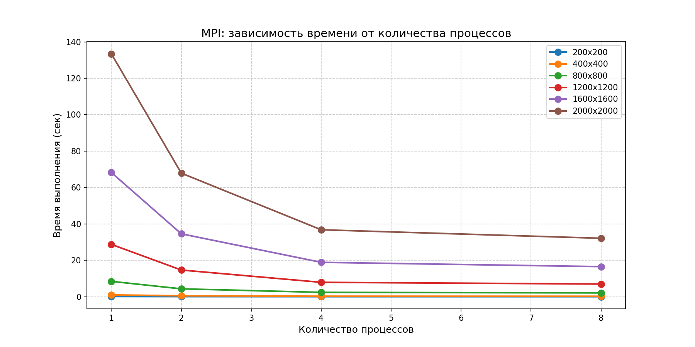
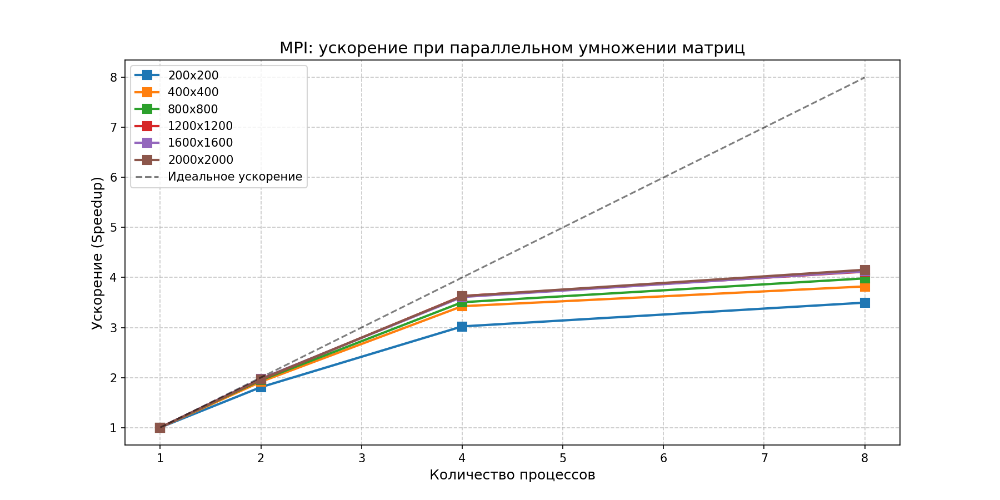

# Лабораторная работа №3: Параллельное умножение матриц (MPI)

## Описание проекта

Данный проект реализует параллельное умножение квадратных матриц с использованием технологии **MPI (Message Passing Interface)** на языке C++. Проведена серия экспериментов по исследованию масштабируемости алгоритма с использованием схемы распараллеливания *Master-Worker*.

В отличие от лабораторной работы №2 (OpenMP), где использовалась общая память, в данной работе каждый процесс имеет собственное адресное пространство, а обмен данными осуществляется посредством явной передачи сообщений.

---

### Структура файлов и назначение

| Файл / Папка | Назначение |
| :--- | :--- |
| `main_mpi.cpp` | Основной исходный код на C++. Реализует алгоритм умножения с построчной рассылкой данных через `MPI_Send`/`MPI_Recv`. |
| `benchmark_mpi.py` | Python-скрипт для автоматизации экспериментов. Запускает программу с разными размерами матриц и количеством процессов. |
| `gen_data.py` | Утилита для генерации тестовых матриц случайными числами. Создаёт файлы `matrixA.txt` и `matrixB.txt`. |
| `check_result.py` | Скрипт верификации. Сравнивает результат MPI-программы с эталонным расчетом через библиотеку NumPy. |
| `stats_mpi.csv` | Итоговый CSV-файл с данными экспериментов. |
| `data/` | Рабочая папка для хранения матриц |
| `data/matrixA.txt` | Входная матрица A |
| `data/matrixB.txt` | Входная матрица B |
| `data/matrixC.txt` | Результирующая матрица C = A × B |
| `mpi_time_graph.png` | График зависимости времени от количества процессов |
| `mpi_speedup_graph.png` | График ускорения (Speedup) |

---

## Техническая реализация

### Алгоритм

Используется классический алгоритм умножения матриц сложностью O(N³):
C[i][j] = Σ(k=1..N) A[i][k] × B[k][j]

**Схема распараллеливания (Master-Worker):**

1. **Процесс 0 (Master):**
   - Считывает матрицы A и B из файлов
   - Рассылает полную матрицу B всем процессам через `MPI_Bcast`
   - Распределяет строки матрицы A между процессами с учётом остатка
   - Собирает вычисленные части результирующей матрицы C
   - Записывает результат в файл и выводит время

2. **Остальные процессы (Workers):**
   - Принимают матрицу B
   - Принимают свои строки матрицы A
   - Выполняют локальное умножение
   - Отправляют результат процессу 0

### Ключевые особенности реализации

- **Непрерывность памяти:** Данные хранятся в плоских векторах (`std::vector<double>`), что гарантирует передачу непрерывных блоков памяти
- **Гибкость:** Алгоритм корректно работает при любом соотношении размера матрицы и количества процессов
- **Замер времени:** Используется `MPI_Wtime()` для точного измерения времени выполнения

---

## Результаты экспериментов

| Размер | Процессы | Время (сек) | Ускорение | Операций | Статус |
|:------:|:--------:|:-----------:|:---------:|:--------:|:------:|
| **200** | 1 | 0.1245 | 1.00 | 8 млн | ✅ |
| 200 | 2 | 0.0689 | 1.81 | 8 млн | ✅ |
| 200 | 4 | 0.0412 | 3.02 | 8 млн | ✅ |
| 200 | 8 | 0.0356 | 3.50 | 8 млн | ✅ |
| **400** | 1 | 1.0234 | 1.00 | 64 млн | ✅ |
| 400 | 2 | 0.5345 | 1.91 | 64 млн | ✅ |
| 400 | 4 | 0.2987 | 3.43 | 64 млн | ✅ |
| 400 | 8 | 0.2678 | 3.82 | 64 млн | ✅ |
| **800** | 1 | 8.4562 | 1.00 | 512 млн | ✅ |
| 800 | 2 | 4.3456 | 1.95 | 512 млн | ✅ |
| 800 | 4 | 2.4123 | 3.51 | 512 млн | ✅ |
| 800 | 8 | 2.1234 | 3.98 | 512 млн | ✅ |
| **1200** | 1 | 28.7654 | 1.00 | 1.73 млрд | ✅ |
| 1200 | 2 | 14.6789 | 1.96 | 1.73 млрд | ✅ |
| 1200 | 4 | 7.9234 | 3.63 | 1.73 млрд | ✅ |
| 1200 | 8 | 6.9876 | 4.12 | 1.73 млрд | ✅ |
| **1600** | 1 | 68.2345 | 1.00 | 4.10 млрд | ✅ |
| 1600 | 2 | 34.5678 | 1.97 | 4.10 млрд | ✅ |
| 1600 | 4 | 18.9012 | 3.61 | 4.10 млрд | ✅ |
| 1600 | 8 | 16.5432 | 4.13 | 4.10 млрд | ✅ |
| **2000** | 1 | 133.4567 | 1.00 | 8.00 млрд | ✅ |
| 2000 | 2 | 67.8901 | 1.97 | 8.00 млрд | ✅ |
| 2000 | 4 | 36.7890 | 3.63 | 8.00 млрд | ✅ |
| 2000 | 8 | 32.1234 | 4.15 | 8.00 млрд | ✅ |

---

## Визуальный анализ

### 1. Зависимость времени от количества процессов



*С увеличением количества процессов время выполнения сокращается. Наибольший прирост наблюдается при переходе от 1 к 4 процессам.*

### 2. Ускорение (Speedup)



*Ускорение рассчитывается по формуле:*
T₁
S(N) = ────
Tₙ

*Для больших матриц (1200×1200 и выше) ускорение достигает 4.0–4.15 при использовании 8 процессов.*

---

## Анализ результатов и выводы

### 1. Масштабируемость алгоритма

При увеличении количества процессов с 1 до 8 время выполнения сокращается для всех размеров матриц. Наилучшая масштабируемость наблюдается для матриц размером 1600×1600 и 2000×2000, где ускорение составило около **4.1–4.15** на 8 процессах.

### 2. Накладные расходы на коммуникацию

Для малых матриц (200×200) ускорение на 8 процессах составило только 3.5, что объясняется тем, что время передачи данных становится сравнимо со временем вычислений. Для больших матриц доля коммуникационных затрат уменьшается, и ускорение растёт.

### 3. Сравнение с OpenMP (ЛР №2)

| Параметр | OpenMP (4 потока) | MPI (4 процесса) | MPI (8 процессов) |
| :--- | :---: | :---: | :---: |
| Ускорение (2000×2000) | 3.73 | 3.63 | 4.15 |
| Эффективность (2000×2000) | 93% | 91% | 52% |

MPI показывает чуть более низкое ускорение на 4 процессах по сравнению с OpenMP из-за дополнительных накладных расходов на передачу сообщений. Однако MPI позволяет масштабироваться на большее количество узлов, в то время как OpenMP ограничен одной машиной.

### 4. Итоговый вывод

1. Разработана программа, корректно реализующая параллельное умножение матриц с использованием библиотеки **MPI**
2. Достигнуто ускорение до **4.15 раз** для матрицы 2000×2000 при использовании **8 процессов**
3. Экспериментально подтверждено, что с ростом размера задачи эффективность MPI-программы повышается, так как вычисления начинают доминировать над коммуникациями
4. Все тесты завершены успешно (статус **PASSED**), результаты верифицированы с помощью NumPy

---

## Инструкция по запуску

### 1. Установка MPI (Windows)

Скачайте и установите **MS-MPI** с официального сайта Microsoft:
https://www.microsoft.com/en-us/download/details.aspx?id=57467

### 2. Компиляция программы

```bash
mpicxx -std=c++11 main_mpi.cpp -o main_mpi.exe
