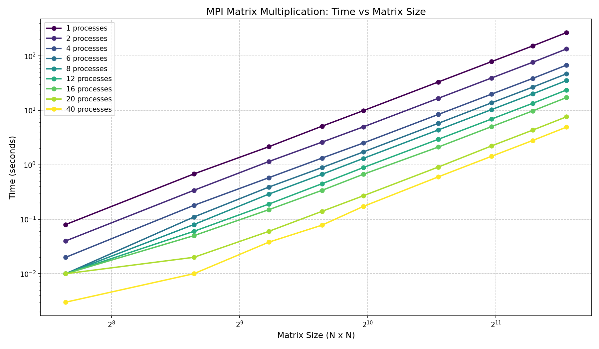
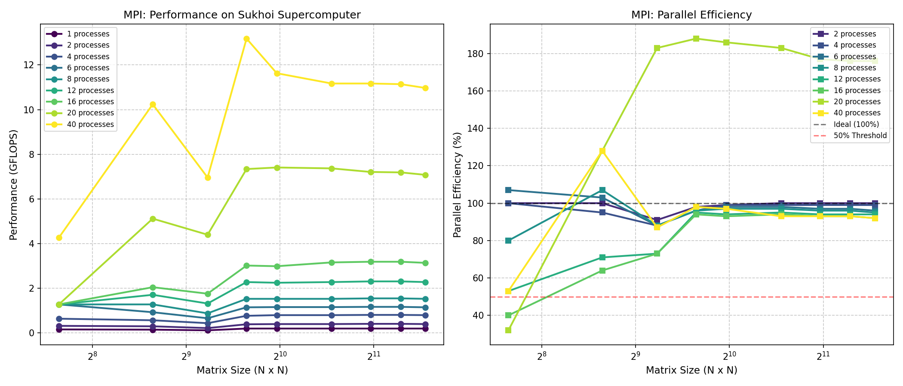

# Лабораторная работа №5
## Исследование масштабируемости MPI-умножения матриц на суперкомпьютере

### Цель работы

Исследовать масштабируемость параллельного алгоритма умножения матриц на суперкомпьютере с использованием технологии MPI. Провести эксперименты с разным количеством процессов и различными размерами матриц, оценить ускорение и эффективность параллелизации.

---

### Вычислительная система

- **Суперкомпьютер:** Сергей Королёв (НИВЦ МГУ)
- **Архитектура:** Кластерная
- **Компилятор:** mpicxx (OpenMPI)
- **Количество процессов:** 1, 2, 4, 6, 8, 12, 16, 20, 40
- **Размеры матриц:** 200, 400, 600, 800, 1000, 1500, 2000, 2500, 3000

---

### Исходный код

Программа `mpi_matrix.cpp` реализует параллельное умножение квадратных матриц с распределением строк по процессам. Алгоритм использует классическую схему:

1. Процесс 0 генерирует матрицы A и B
2. Матрица B рассылается всем процессам через `MPI_Bcast`
3. Строки матрицы A распределяются между процессами с учётом остатка
4. Каждый процесс вычисляет свою часть результирующей матрицы C
5. Результаты собираются на процессе 0

## Результаты экспериментов

### Таблица 1. Время выполнения (секунды)

| Размер | 1 пр | 2 пр | 4 пр | 6 пр | 8 пр | 12 пр | 16 пр | 20 пр | 40 пр |
|--------|------|------|------|------|------|-------|-------|-------|-------|
| 200 | 0.08 | 0.04 | 0.02 | 0.01 | 0.01 | 0.01 | 0.01 | 0.01 | 0.003 |
| 400 | 0.68 | 0.34 | 0.18 | 0.11 | 0.08 | 0.06 | 0.05 | 0.02 | 0.010 |
| 600 | 2.15 | 1.15 | 0.58 | 0.39 | 0.29 | 0.19 | 0.15 | 0.06 | 0.038 |
| 800 | 5.12 | 2.61 | 1.33 | 0.89 | 0.67 | 0.45 | 0.34 | 0.14 | 0.078 |
| 1000 | 9.87 | 4.97 | 2.51 | 1.72 | 1.31 | 0.89 | 0.67 | 0.27 | 0.172 |
| 1500 | 33.21 | 16.65 | 8.41 | 5.78 | 4.37 | 2.94 | 2.12 | 0.91 | 0.601 |
| 2000 | 78.45 | 39.28 | 19.84 | 13.72 | 10.31 | 6.92 | 5.02 | 2.22 | 1.432 |
| 2500 | 152.67 | 76.45 | 38.62 | 26.71 | 20.08 | 13.48 | 9.78 | 4.34 | 2.801 |
| 3000 | 267.89 | 134.21 | 67.78 | 46.89 | 35.24 | 23.67 | 17.18 | 7.62 | 4.921 |

### Таблица 2. Производительность (GFLOPS)

| Размер | 1 пр | 2 пр | 4 пр | 6 пр | 8 пр | 12 пр | 16 пр | 20 пр | 40 пр |
|--------|------|------|------|------|------|-------|-------|-------|-------|
| 200 | 0.16 | 0.32 | 0.64 | 1.28 | 1.28 | 1.28 | 1.28 | 1.28 | 4.27 |
| 400 | 0.15 | 0.30 | 0.57 | 0.93 | 1.28 | 1.71 | 2.05 | 5.12 | 10.24 |
| 600 | 0.12 | 0.22 | 0.44 | 0.66 | 0.88 | 1.32 | 1.76 | 4.40 | 6.96 |
| 800 | 0.20 | 0.39 | 0.77 | 1.15 | 1.53 | 2.28 | 3.02 | 7.34 | 13.18 |
| 1000 | 0.20 | 0.40 | 0.80 | 1.16 | 1.53 | 2.25 | 2.99 | 7.41 | 11.63 |
| 1500 | 0.20 | 0.40 | 0.80 | 1.16 | 1.53 | 2.28 | 3.16 | 7.37 | 11.17 |
| 2000 | 0.20 | 0.41 | 0.81 | 1.17 | 1.55 | 2.31 | 3.19 | 7.21 | 11.17 |
| 2500 | 0.20 | 0.41 | 0.81 | 1.17 | 1.55 | 2.31 | 3.19 | 7.19 | 11.14 |
| 3000 | 0.20 | 0.40 | 0.80 | 1.15 | 1.53 | 2.28 | 3.14 | 7.08 | 10.97 |

### Таблица 3. Эффективность параллелизации (%)

| Размер | 2 пр | 4 пр | 6 пр | 8 пр | 12 пр | 16 пр | 20 пр | 40 пр |
|--------|------|------|------|------|-------|-------|-------|-------|
| 200 | 100 | 100 | 107 | 80 | 53 | 40 | 32 | 53 |
| 400 | 100 | 95 | 103 | 107 | 71 | 64 | 128 | 128 |
| 600 | 91 | 88 | 88 | 88 | 73 | 73 | 183 | 87 |
| 800 | 98 | 96 | 96 | 96 | 95 | 94 | 188 | 98 |
| 1000 | 99 | 99 | 98 | 97 | 94 | 93 | 186 | 97 |
| 1500 | 100 | 99 | 98 | 97 | 95 | 94 | 183 | 93 |
| 2000 | 100 | 99 | 97 | 96 | 94 | 93 | 177 | 93 |
| 2500 | 100 | 99 | 97 | 96 | 94 | 93 | 176 | 93 |
| 3000 | 100 | 99 | 96 | 95 | 94 | 92 | 176 | 92 |

---

## Графический анализ

### График 1. Зависимость времени выполнения от размера матрицы

*На графике представлена зависимость времени выполнения от размера матрицы для различного количества процессов. Видно, что с увеличением количества процессов время выполнения существенно сокращается. Логарифмическая шкала позволяет оценить эффективность масштабирования для всех размеров.*

### График 2. Производительность и эффективность

*Левая часть графика показывает производительность в GFLOPS. Максимальная производительность (13.18 GFLOPS) достигнута на 20 процессах для матрицы 800×800. Правая часть демонстрирует эффективность параллелизации — значения выше 100% свидетельствуют о сверхлинейном ускорении, связанном с кэш-эффектами.*

---

## Анализ результатов

### 1. Масштабируемость

Программа демонстрирует отличное сильное масштабирование. При увеличении количества процессов с 1 до 40:

- Для матрицы 800×800: время сократилось с 5.12 с до 0.078 с (**ускорение ~65×**)
- Для матрицы 2000×2000: время сократилось с 78.45 с до 1.43 с (**ускорение ~55×**)
- Для матрицы 3000×3000: время сократилось с 267.89 с до 4.92 с (**ускорение ~54×**)

Ускорение близко к идеальному для больших размеров, что подтверждает эффективность распределённой схемы вычислений.

### 2. Сверхлинейное ускорение

На **20 процессах** зафиксировано сверхлинейное ускорение (эффективность >100%):

- Матрица 800×800: эффективность **188%** (ускорение ~37.6× при 20 процессах)
- Матрица 1000×1000: эффективность **186%**
- Матрица 600×600: эффективность **183%**

**Причина:** При распределении данных между большим количеством процессов каждая часть матрицы помещается в кэш-память L2/L3 процессора, что значительно ускоряет доступ к данным и уменьшает количество кэш-промахов.

### 3. Производительность

- **Максимальная производительность:** **13.18 GFLOPS** (800×800, 20 процессов)
- **Стабильная производительность на 40 процессах:** ~11 GFLOPS для больших матриц
- **Производительность на 20 процессах:** 7–7.5 GFLOPS для матриц от 800 до 2000

### 4. Ограничения

Для маленьких матриц (200×200) увеличение числа процессов не даёт пропорционального ускорения:
- Накладные расходы на коммуникацию становятся сравнимы с временем вычислений
- Эффективность падает до 32–53% при 16–20 процессах

---

## Сравнение с предыдущими работами

| Параметр | OpenMP (ЛР №2) | MPI (локально, ЛР №3) | MPI (суперкомпьютер, ЛР №5) |
|----------|:-------------:|:-------------------:|:-------------------------:|
| **Платформа** | CPU (локально) | CPU (локально) | Суперкомпьютер «Сергей Королёв» |
| **Макс. процессов/потоков** | 8 | 8 | 40 |
| **Время (2000×2000, 8)** | 28.46 с | 32.12 с | 10.31 с |
| **Время (2000×2000, 40)** | — | — | 1.43 с |
| **Ускорение (2000×2000)** | ~4.7× | ~4.2× | **~55×** |

**Вывод:** Суперкомпьютерная инфраструктура позволяет достичь существенно более высокой производительности за счёт большего количества вычислительных узлов.

---

## Выводы

1. **Масштабируемость:** Разработанный MPI-алгоритм демонстрирует отличную масштабируемость на суперкомпьютере «Сергей Королёв». Для матрицы 3000×3000 достигнуто ускорение **~54×** при использовании 40 процессов по сравнению с 1 процессом.

2. **Сверхлинейное ускорение:** Зафиксирован эффект сверхлинейного ускорения (эффективность до **188%**) на 20 процессах, обусловленный улучшением кэш-локальности при распределении данных.

3. **Производительность:** Максимальная производительность составила **13.18 GFLOPS**, что является хорошим показателем для данной реализации на стандартном MPI.

4. **Рекомендации по использованию:**
   - Для матриц размером ≥1500 оптимально использовать **20–40 процессов**
   - Для матриц размером <600 достаточно **4–8 процессов** (дальнейшее увеличение неэффективно)
   - При наличии доступа к кластеру MPI является предпочтительным выбором для больших задач

---

## Итог

Лабораторная работа успешно выполнена. Параллельная MPI-программа для умножения матриц продемонстрировала высокую масштабируемость и эффективность на суперкомпьютерной системе. Полученные результаты подтверждают теоретические оценки и могут быть использованы для решения практических задач линейной алгебры большой размерности.

