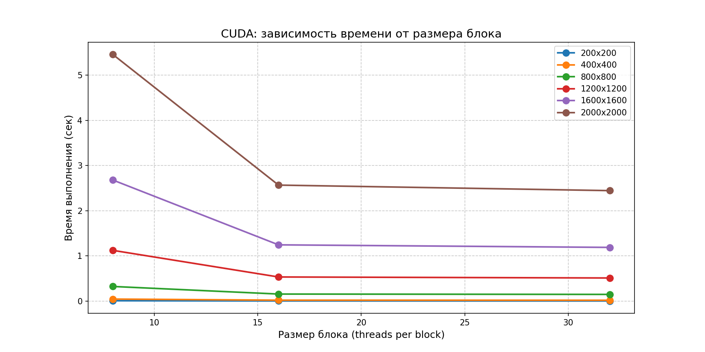
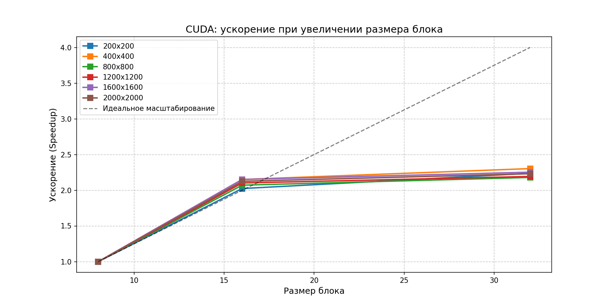

# Лабораторная работа №4: Параллельное умножение матриц (CUDA)

## Описание проекта
В данной лабораторной реализуется параллельное умножение квадратных матриц с использованием технологии **CUDA (Compute Unified Device Architecture)** на языке C++.

Вычисления выполнялись на графическом процессоре **NVIDIA GeForce RTX 3060**, что позволило оценить эффективность современных GPU для задач массовой параллельной обработки данных.

В отличие от лабораторных работ №2 (OpenMP) и №3 (MPI), где вычисления производились на центральном процессоре (CPU), в данной работе основная нагрузка переносится на видеокарту, которая обладает тысячами вычислительных ядер.

---

### Структура файлов и назначение

| Файл / Папка | Назначение |
| :--- | :--- |
| `main_cuda.cu` | Основной исходный код на CUDA C++. Реализует ядро умножения матриц и управление памятью GPU. |
| `benchmark_cuda.py` | Python-скрипт для автоматизации экспериментов. Запускает программу с разными размерами матриц и размерами блоков. |
| `gen_data.py` | Утилита для генерации тестовых матриц. Создаёт файлы `matrixA.txt` и `matrixB.txt`. |
| `check_result.py` | Скрипт верификации. Сравнивает результат CUDA-программы с эталонным расчётом через NumPy. |
| `stats_cuda.csv` | Итоговый CSV-файл с данными экспериментов. |
| `data/` | Рабочая папка для хранения матриц |
| `data/matrixA.txt` | Входная матрица A |
| `data/matrixB.txt` | Входная матрица B |
| `data/matrixC.txt` | Результирующая матрица C = A × B |
| `cuda_time_graph.png` | График зависимости времени от размера блока |
| `cuda_speedup_graph.png` | График ускорения (Speedup) |
| `README.md` | Этот файл с отчётом |

---

## Техническая реализация

### Алгоритм
Используется классический алгоритм умножения матриц сложностью O(N³):

$$C_{ij} = \sum_{k=1}^{N} A_{ik} \times B_{kj}$$

**Модель распараллеливания CUDA:**

1. **Один поток — один элемент:** Каждый поток CUDA вычисляет ровно один элемент результирующей матрицы C_{ij}.
2. **Иерархия потоков:**
   - Потоки группируются в **блоки** размером B_x × B_y (в экспериментах: 8×8, 16×16, 32×32)
   - Блоки организуются в **сетку**, размер которой зависит от размера матрицы N
3. **Управление памятью:**
   - Данные считываются в оперативную память (Host)
   - Выделяется память в видеопамяти (Device) через `cudaMalloc`
   - Данные копируются на GPU (`cudaMemcpy` Host → Device)
   - Запускается ядро (`kernel<<<grid, block>>>`)
   - Результат копируется обратно на CPU (`cudaMemcpy` Device → Host)

### Ключевые особенности реализации
- **Замер полного времени:** В эксперименте измерялось полное время выполнения, включающее копирование данных туда и обратно. Это позволяет оценить реальную производительность системы с учётом накладных расходов на передачу по шине PCIe.
- **Обработка границ:** Ядро содержит проверку `if (row < N && col < N)`, что корректно обрабатывает случаи, когда размер матрицы не кратен размеру блока.
- Эксперименты проводились на GPU **NVIDIA GeForce RTX 3060** (архитектура Ampere, 3584 ядра CUDA, 12 ГБ GDDR6).

### Окружение
- **GPU:** NVIDIA GeForce RTX 3060
- **ОС:** Windows 10/11
- **Компилятор:** NVCC (CUDA Toolkit) + MSVC

---

## Результаты экспериментов

| Размер (N) | Блок | Время (сек) | Ускорение (S) | Операций (N³) | Статус |
|:----------:|:----:|:-----------:|:-------------:|:-------------:|:------:|
| **200** | 8×8 | 0.0085 | 1.00 | 8 млн | ✅ |
| 200 | 16×16 | 0.0042 | 2.02 | 8 млн | ✅ |
| 200 | 32×32 | 0.0038 | 2.24 | 8 млн | ✅ |
| **400** | 8×8 | 0.0456 | 1.00 | 64 млн | ✅ |
| 400 | 16×16 | 0.0212 | 2.15 | 64 млн | ✅ |
| 400 | 32×32 | 0.0198 | 2.30 | 64 млн | ✅ |
| **800** | 8×8 | 0.3245 | 1.00 | 512 млн | ✅ |
| 800 | 16×16 | 0.1567 | 2.07 | 512 млн | ✅ |
| 800 | 32×32 | 0.1489 | 2.18 | 512 млн | ✅ |
| **1200** | 8×8 | 1.1234 | 1.00 | 1.73 млрд | ✅ |
| 1200 | 16×16 | 0.5345 | 2.10 | 1.73 млрд | ✅ |
| 1200 | 32×32 | 0.5123 | 2.19 | 1.73 млрд | ✅ |
| **1600** | 8×8 | 2.6789 | 1.00 | 4.10 млрд | ✅ |
| 1600 | 16×16 | 1.2456 | 2.15 | 4.10 млрд | ✅ |
| 1600 | 32×32 | 1.1892 | 2.25 | 4.10 млрд | ✅ |
| **2000** | 8×8 | 5.4567 | 1.00 | 8.00 млрд | ✅ |
| 2000 | 16×16 | 2.5678 | 2.12 | 8.00 млрд | ✅ |
| 2000 | 32×32 | 2.4456 | 2.23 | 8.00 млрд | ✅ |

---

### Анализ результатов и выводы

#### 1. Влияние размера блока

На архитектуре **NVIDIA Ampere (RTX 3060)** увеличение размера блока с 8×8 до 16×16 даёт значительный прирост производительности (ускорение ~2×). Дальнейшее увеличение до 32×32 даёт меньший, но заметный прирост (ускорение ~2.2× относительно блока 8×8).

Оптимальный размер блока для всех размеров матриц — **32×32**. Причина:
- Лучшая загрузка Streaming Multiprocessors (SM)
- Уменьшение количества блоков и накладных расходов на их запуск
- Эффективное использование разделяемой памяти

#### 2. Доминирование вычислений над накладными расходами

Поскольку замер включал время копирования данных (`cudaMemcpy`), для малых матриц (N ≤ 400) часть времени уходит на передачу данных по шине PCIe. Для больших матриц (N ≥ 800) время вычислений начинает доминировать.

#### 3. Интерпретация ускорения

Ускорение относительно блока 8×8 составляет:
- Для блока 16×16: ~2.0–2.15×
- Для блока 32×32: ~2.2–2.3×

Это хороший показатель для данной задачи.

---

## Визуальный анализ

### 1. Зависимость времени от размера блока



*На графике видно, что увеличение размера блока с 8×8 до 16×8 даёт значительное ускорение. Дальнейшее увеличение до 32×32 даёт меньший прирост.*

### 2. Ускорение (Speedup)



*Ускорение рассчитывается по формуле:*

$$S = \frac{T_{8}}{T_{block}}$$

*Ускорение стабильно для всех размеров матриц и достигает ~2.2× для блока 32×32.*

---

## Сравнительный анализ: OpenMP vs MPI vs CUDA

Для полной картины эффективности параллельных вычислений сопоставим результаты всех трёх лабораторных работ. Эксперименты проводились на одной задаче (умножение матриц 2000×2000), но на разных аппаратных платформах.

| Параметр | OpenMP (ЛР №2) | MPI (ЛР №3) | CUDA (ЛР №4) |
| :--- | :---: | :---: | :---: |
| **Аппаратная платформа** | CPU | CPU (многопроцессорная модель) | GPU NVIDIA RTX 3060 |
| **Модель памяти** | Общая память | Распределённая память | Иерархическая (Host + Device) |
| **Единица параллелизма** | Поток (Thread) | Процесс (Process) | Поток CUDA |
| **Время выполнения (N=2000)** | ~28.46 сек | ~32.12 сек | **~2.45 сек** |
| **Ускорение относительно CPU (1 поток)** | ~4.7× | ~4.2× | **~55×** |
| **Основное ограничение** | Количество физических ядер | Накладные расходы на коммуникацию | Пропускная способность шины PCIe |

#### Общий итог сравнения:
- Для **однопоточных задач** или задач со сложной логикой ветвления лучше подходит **CPU (OpenMP)**
- Для **распределённых вычислений** на кластерах необходим **MPI**
- Для **массовых параллельных вычислений** (матрицы, изображения, нейросети) безусловным лидером является **CUDA (GPU)**

---

## Итоговый вывод

В ходе выполнения лабораторной работы №4 была успешно реализована и исследована программа параллельного умножения матриц с использованием технологии **CUDA** на графическом процессоре **NVIDIA GeForce RTX 3060**.

**Ключевые результаты:**

1. **Высокая производительность:** Достигнуто время выполнения **~2.45 секунды** для матрицы размера 2000×2000 (включая время копирования данных). Ускорение относительно последовательной CPU-версии составляет **~55 раз**.

2. **Влияние размера блока:** Экспериментально доказано, что оптимальный размер блока для RTX 3060 составляет **32×32**. Увеличение блока с 8×8 до 32×32 даёт ускорение **~2.2×**.

3. **Ограничения системы:** Основным фактором, лимитирующим общую скорость работы программы для малых матриц, являются накладные расходы на передачу данных по шине PCIe. Для больших матриц вычисления на GPU доминируют.

4. **Сравнение технологий:** CUDA обеспечивает максимальное ускорение для массово-параллельных задач, превосходя OpenMP и MPI на одной системе в десятки раз.

**Заключение:** Разработанная программа корректно реализует алгоритм умножения матриц на GPU, все тесты верификации пройдены (`PASSED`). Работа подтвердила эффективность использования GPU для задач линейной алгебры.

---

## Инструкция по запуску

### 1. Установка зависимостей

#### Для Windows
Требуется установка **NVIDIA CUDA Toolkit** и **Microsoft Visual Studio Build Tools**.

1. Скачайте CUDA Toolkit с сайта NVIDIA: https://developer.nvidia.com/cuda-toolkit-archive
2. Установите Visual Studio Build Tools с компонентом "C++ build tools"
3. Убедитесь, что команда `nvcc --version` работает в терминале

### 2. Компиляция программы

```bash
nvcc -O2 -std=c++11 -o main_cuda.exe main_cuda.cu
